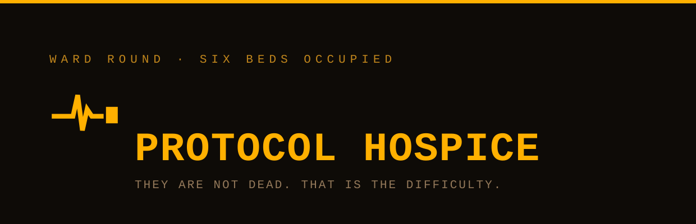

<p align="center">
  
</p>

<p align="center">
  <strong>Ward round &middot; six beds occupied.</strong><br>
  They are not dead. That is the difficulty.
</p>

---

This repository contains the public site for the Protocol Hospice
(hospice.besteffortindustries.com), which keeps six network protocols
comfortable and writes down what each of them can still do.

## The ward

A museum would be easier. A museum takes things that have stopped. Every
protocol on this ward is still answering, still carrying traffic for
somebody, and still being described in the present tense by people who
have not been told otherwise.

The hospice does not cure and does not extubate. It records the
admission date, the condition, and the work the patient can still do
better than anything that replaced it.

| Bed | Patient | Admitted | Condition |
| --- | --- | --- | --- |
| 01 | Gopher | RFC 1436, 1991 | Comfortable |
| 02 | Finger | RFC 742, 1977 | Declining |
| 03 | Telnet | RFC 854, 1983 | Stable |
| 04 | FTP | RFC 959, 1985 | Declining |
| 05 | NNTP | RFC 977, 1986 | Comfortable |
| 06 | X11 | X Protocol, 1987 | Critical |

IRC is not a patient. It was admitted twice and discharged itself both
times, most recently in 2021 when its largest network changed hands and
most of the channels stood themselves up elsewhere within days. SMTP is
not a patient either; it visits daily, is four years older than the
oldest thing on the ward, and has outlived at least three of its own
declared successors.

## What the site actually does

Everything runs client-side and every protocol, RFC number and date on
the page is real:

* **The consultation desk** takes a job — move a file, reach a box with no
  web interface, put a window from one machine onto another — and names
  the patient that can still do it, with a note on how carefully to
  approach. Answering "this is for production" gets the honest advice:
  wrap it, terminate it behind something modern, and stop apologising.
* **The occupancy chart** puts every patient and every death on one axis,
  1975 to now. A line begins at first publication; the four that ended
  stop, with a red cap, at the year the last public server went dark. The
  six that have not ended run off the right-hand edge under an arrowhead.
  Nothing on it is an estimate.
* **The ward** gives each patient an admission date, what it can still do,
  a note from the attending, and a condition, carried as a coloured stripe
  down the left edge of the bed so the six read at a glance.
* **The deceased register** records WAIS, Archie, WHOIS (formally
  superseded by RDAP, with the gTLD sunset in January 2025) and the
  `r`-commands, on the principle that a protocol is dead when the last
  public server is gone and the clients have left the distributions, not
  when a conference decides it is over.

---

## Development notes

The parody ends here. The rest of this file is accurate.

### Layout

A static, zero-build, zero-dependency site. Two HTML files and a handful
of generated images. There is no framework, no bundler and no
`package.json`. Cloudflare Pages serves the repository root exactly as it
appears here.

```
index.html            the site, ward and consultation desk included
404.html              catch-all, served automatically by Cloudflare Pages
favicon.svg           icon, written by hand (no text, so nothing to outline)
favicon.ico           16/32/48, generated
apple-touch-icon.png  180x180, generated
og.png                1200x630 share image, generated
assets/logo.svg       wordmark, text outlined, used at the top of this README
tools/og.html         source for og.png
tools/logo-src.svg    source for assets/logo.svg, text still live
tools/favicon-16.svg  pixel-grid 16px icon, used for the smallest .ico entry
Makefile              asset regeneration only, never runs at deploy time
_headers              Cloudflare Pages header rules
robots.txt            permissive
wrangler.toml         Cloudflare Pages configuration
mise.toml             pins the Wrangler version used to deploy
```

The page makes zero requests to any external domain, and the ward's six
bed records live in one array at the top of the script rather than in the
markup, because they are data and the page renders them.

## The design

An amber terminal, not a green one. Green phosphor is the reflex choice
and it reads cold; amber reads like something being kept warm, which is
the entire subject. Box-drawing characters carry the banner rules and the attending's
notes are set in italic, so the clinical record and the human aside are
visibly different registers.

Four decisions worth keeping:

* **The tone is affection, not mockery.** Every other division in the
  fleet is deadpan-bureaucratic. This one is warm on purpose, and the
  restraint is what makes the joke land: nothing on the page laughs at a
  protocol for still working.
* **One animated thing.** A single blinking block cursor in the ward
  clock, which stops entirely under `prefers-reduced-motion`. No
  scanlines, no CRT curvature, no typing effect.
* **Colour means something.** In a monochrome terminal a second hue is an
  event, so green appears only on a Comfortable condition and beside SMTP,
  and red only on Critical, the deceased register, and the cap that ends a
  line on the occupancy chart.
* **The chart carries the thesis.** Six lines that do not end, beside four
  that do, on one axis, says what the whole site is about before a word of
  it is read. It replaced six small per-bed sparklines, which said the
  same thing six times and never once compared them.

### The production domain

The hospice has no domain of its own, so its canonical host is a
subdomain of the parent: `hospice.besteffortindustries.com`. That is the
host every absolute URL on the page points at, so link previews resolve.
If the site is ever promoted to a domain of its own, the canonical host
changes in the places below and nothing else derives it:

| File | What to change |
| --- | --- |
| `index.html` | `rel=canonical`, `og:url`, `og:image`, `twitter:image` |
| `404.html` | nothing, the 404 uses only root-relative paths |
| `tools/og.html` | the domain printed in the footer of the share image |
| `README.md` | this table, and the mentions above it |

After changing `tools/og.html`, re-run `make og`.

### Local preview

```sh
make serve          # python3 -m http.server 8000
```

Then open `http://localhost:8000`. A local server is preferable to opening
the file directly because the icon paths are root-absolute.

### Regenerating images

Only needed when the wordmark, the icon or the share image changes.
Requires `google-chrome`, ImageMagick 7 (`magick`) and Inkscape on the
machine doing the regenerating; none of them is needed to deploy, because
the outputs are committed. Courier New resolves through fontconfig to
Liberation Mono, which is metric-compatible, so the rendered assets match
what most non-Apple visitors see in the browser.

```sh
make assets         # everything below
make og             # og.png     <- tools/og.html, via headless Chrome
make favicon        # favicon.ico + apple-touch-icon.png <- the SVG sources
make logo           # assets/logo.svg <- tools/logo-src.svg, text outlined
```

`make logo` outlines the wordmark's text so the README renders the same
whether or not the viewer has a monospace face. Inkscape rewrites the
whole file, so the `GENERATED` comment at the top has to be pasted back
afterwards. `favicon.svg` is not generated; it has no text in it.

### Deploying

Wrangler is configured via `wrangler.toml`, so a deploy is one command
from an authenticated shell:

```sh
make deploy         # wrangler pages deploy .
```

The Wrangler version is pinned by `mise.toml` (this machine manages its
Wrangler through [mise](https://mise.jdx.dev/); the global config tracks
`latest`, the repo pins an exact version). To move the pin, edit
`mise.toml`, run `mise install`, and deploy once to confirm nothing moved
underneath.

### Which Cloudflare account this deploys to

This machine has two Cloudflare identities, and picking the wrong one
deploys this site into an unrelated organisation.

**Pages configuration cannot pin the account.** `account_id` is a
Workers-only key; putting it in a Pages `wrangler.toml` makes Wrangler
refuse to run. So the account is selected by **an auth profile bound to
this directory**, recorded in
`~/.config/.wrangler/profiles/directory-bindings.json`:

```sh
wrangler auth activate personal    # already done; re-run after moving the repo
wrangler whoami                    # must print: Active profile: personal
```

Without a binding, Wrangler falls back to the `default` profile, which
here is the other organisation, and it will deploy there without asking.
**Check `whoami` before deploying.** The binding lives outside the repo,
so a fresh clone, a moved directory, or another machine all need
`wrangler auth activate` again.

One extra trap: Wrangler caches the resolved account in the untracked
`.wrangler/cache/wrangler-account.json` inside this directory. If a deploy
ever went to the wrong account from here, activating the right profile is
**not** enough; delete `.wrangler/` as well, or the cached account ID wins
and the API call fails with `Authentication error [code: 10000]`.

For CI, where profiles do not exist, set `CLOUDFLARE_ACCOUNT_ID` (the
account to deploy into) and `CLOUDFLARE_API_TOKEN` (credentials scoped to
it) as environment variables.

The Pages project is `protocolhospice`, production branch `main`, with no
build command and the build output directory set to `/`. If you ever
recreate it from the dashboard, use exactly those values; there is
nothing to build, and any build command entered there will only make the
deployment worse.

To wire the Git integration instead, connect the `holthe/protocol-hospice`
repository under **Workers & Pages -> Create -> Pages -> Connect to Git**
with the same settings.

### Custom domain

Deploy at least once first, so the project exists. Then, in the dashboard
under **Workers & Pages** -> `protocolhospice` -> **Custom domains** ->
**Set up a custom domain**, add `hospice.besteffortindustries.com`. The
zone is already on Cloudflare, so the CNAME is created for you; do not
create the record by hand first, because a pre-existing record blocks the
flow. Universal SSL already covers one level of subdomain on that zone,
so the certificate needs no extra step.

Until the domain is attached the site is reachable at
`protocolhospice.pages.dev`.

### Related

The hospice is a division of
[Best Effort Industries](https://besteffortindustries.com). The register
there is the only authority on division numbering, and this repository
deliberately records none: the site files itself as `BEI-PH`, which is
derived from the hospice's own name and cannot go stale when the register
renumbers.

## License

Parody. The protocols are real, the RFC numbers are real, the browsers
really did drop FTP in 2021, and the hospice is the only party involved
that never existed.
